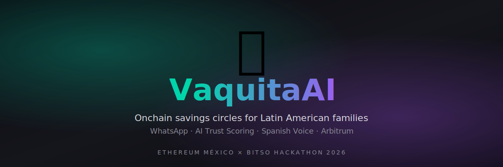
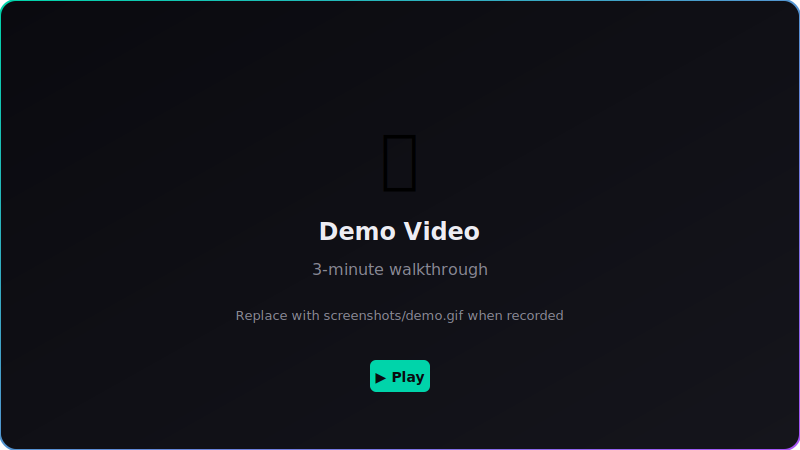
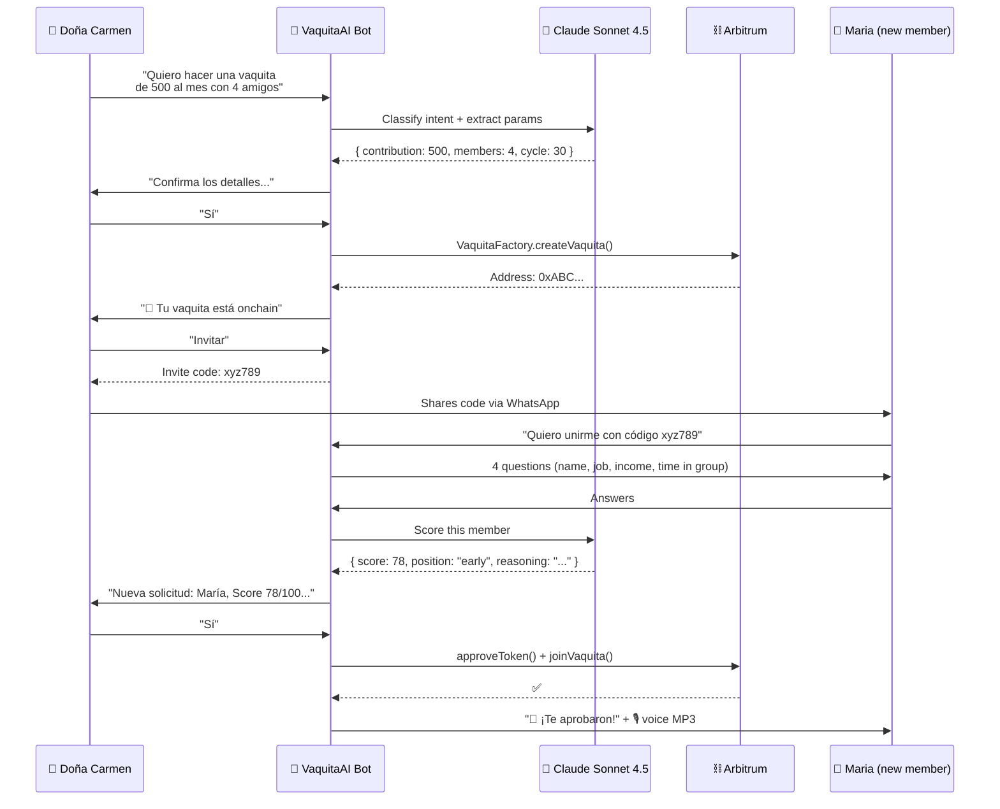
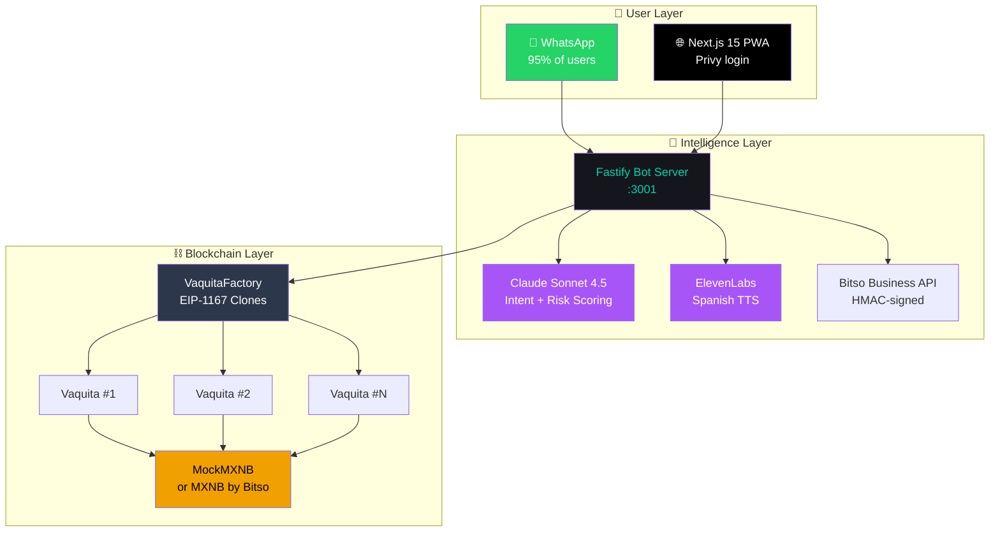

<div align="center">



<br/>

[](http://localhost:3002)
[](https://wa.me/14155238886?text=join%20till-breathing)
[](https://sepolia.arbiscan.io/address/0xfFa51C1A2c2BDCA722045CB637D1b36E1bE6892E)

[]()
[]()
[]()
[]()
[]()

**The traditional Latin American savings circle — supercharged with AI trust scoring, Spanish voice notifications, and an uncheatable on-chain ledger.**

[**🎬 Watch Demo (3 min)**](#-demo) · [**📚 Docs**](./docs) · [**🏗️ Architecture**](./ARCHITECTURE.md) · [**📝 Submission**](./SUBMISSION.md)

</div>

---

## 📑 Table of Contents

- [The Problem](#-the-problem)
- [Our Solution](#-our-solution)
- [Demo](#-demo)
- [How It Works](#-how-it-works)
- [Tech Stack](#-tech-stack)
- [Architecture](#%EF%B8%8F-architecture)
- [What's Deployed](#-whats-deployed)
- [Quick Start](#-quick-start)
- [Project Structure](#-project-structure)
- [Quality Bar](#-verifiable-quality-bar)
- [Hackathon Tracks](#-hackathon-track-submissions)
- [Roadmap](#-roadmap)
- [FAQ & Troubleshooting](#-faq--troubleshooting)
- [Built By](#-built-by)

---

## 🎯 The Problem

> *"Mi prima perdió el cuaderno de la vaquita y se armó la pelea. Mejor ya no participo."*
> — Doña Carmen, Querétaro

In Latin America, **over 80% of households** save through informal rotating savings groups called *vaquitas*, *tandas*, or *cundinas*. **Trillions of pesos** move through these circles every year — but they're plagued by problems:

<table>
<tr>
<td width="50%" valign="top">

### 📓 The Old Way

❌ "The treasurer's notebook got lost"
❌ "Pedro disappeared with the pot" 😱
❌ "I already paid this month!" (disputes)
❌ "You have to come in person"
❌ Zero protection if someone defaults

</td>
<td width="50%" valign="top">

### ✨ The VaquitaAI Way

✅ Every transaction logged immutably on-chain
✅ Smart contract collateral protects the group
✅ Audit trail of every contribution and payout
✅ Members participate from anywhere via WhatsApp
✅ AI evaluates trustworthiness before joining

</td>
</tr>
</table>

---

## 💡 Our Solution

**VaquitaAI is the same vaquita your grandmother runs — but powered by smart contracts, AI, and WhatsApp.**

Members never download an app. They chat with a bot in **natural Mexican Spanish**. An AI agent powered by **Claude Sonnet 4.5** evaluates each new member with 4 friendly questions (occupation, income, time in community) and proposes a fair payout order. Smart contracts on **Arbitrum** hold the collateral, so nobody can disappear with the money. When it's your turn to receive, a **calm Spanish voice from ElevenLabs** announces your win.

### What makes it different from any existing fintech:

| Feature | VaquitaAI | Traditional Fintech | Other Web3 |
|---|:---:|:---:|:---:|
| WhatsApp-native onboarding | ✅ | ❌ | ❌ |
| No app to install | ✅ | ❌ | ❌ |
| AI evaluates trust without bank data | ✅ | ❌ | ❌ |
| Voice notifications in Spanish | ✅ | ❌ | ❌ |
| Open-source verifiable contracts | ✅ | ❌ | Partial |
| Pesos-native (MXNB) | ✅ | Partial | ❌ |
| Built for Doña Carmen | ✅ | ❌ | ❌ |

---

## 🎬 Demo

> *Replace this section with your demo GIF/video once recorded.*

<div align="center">



**[▶️ Watch the 3-minute demo on YouTube](https://youtube.com/) — link will go here**

</div>

### Demo highlights to capture
- [ ] User says "hacer una vaquita de 500 al mes con 4 amigos" in WhatsApp
- [ ] Bot guides through creation flow in Spanish
- [ ] Transaction confirmed on Arbiscan
- [ ] Invite code generated and shared
- [ ] New member joins, AI scores them (live, with reasoning)
- [ ] Creator approves, candidate receives Spanish voice welcome
- [ ] All transactions verifiable on Arbiscan

---

## ⚡ How It Works



---

## 🧰 Tech Stack

<table>
<tr>
<td valign="top" width="33%">

### Smart Contracts
-  `0.8.24`
-  testing
-  v5
- EIP-1167 minimal proxies
- 44 tests passing

</td>
<td valign="top" width="33%">

### Backend Agent
- 
-  strict
- 
- viem · Anthropic SDK
- ElevenLabs · Twilio · Bitso

</td>
<td valign="top" width="33%">

### Frontend
- 
- 
- 
- Privy embedded wallets
- wagmi v2 + viem

</td>
</tr>
</table>

### AI Stack
- 🧠 **Claude Sonnet 4.5** (Anthropic) — Intent classification + risk scoring + payout ordering
- 🎙️ **ElevenLabs** (multilingual v2) — Spanish text-to-speech, warm female voice

### Infrastructure
- ⛓️ **Arbitrum Sepolia** (V1) · **Arbitrum One** (V2-ready)
- 🇲🇽 **MXNB by Bitso** — Mexican peso stablecoin, 1:1 backed
- 📱 **Twilio WhatsApp Sandbox** (V1) · Production-ready
- 🔐 **Privy** — embedded wallets, social login

---

## 🏗️ Architecture



📖 **Detailed architecture:** [ARCHITECTURE.md](./ARCHITECTURE.md)

---

## 📡 What's Deployed

All contracts are **verified** on Arbitrum Sepolia with source code publicly visible:

| Contract | Address | Status |
|---|---|:---:|
| 🏭 **VaquitaFactory** | [`0xfFa51C1A2c2BDCA722045CB637D1b36E1bE6892E`](https://sepolia.arbiscan.io/address/0xfFa51C1A2c2BDCA722045CB637D1b36E1bE6892E) | ✅ Verified |
| 📋 **Vaquita Implementation** | [`0xdf0Da6E12A77a90bbb4cEF1ef448FFAFf1352717`](https://sepolia.arbiscan.io/address/0xdf0Da6E12A77a90bbb4cEF1ef448FFAFf1352717) | ✅ Verified |
| 🪙 **MockMXNB Token** | [`0xBA717164E68625e5e9E9C5Cd380c38ecFACf481c`](https://sepolia.arbiscan.io/address/0xBA717164E68625e5e9E9C5Cd380c38ecFACf481c) | ✅ Verified |

**Real MXNB token address (V2 / Arbitrum One mainnet):** `0xF197FFC28c23E0309B5559e7a166f2c6164C80aA`

---

## 🚀 Quick Start

### Prerequisites
- Node.js 20+
- [Foundry](https://book.getfoundry.sh/getting-started/installation)
- A wallet with Arbitrum Sepolia ETH ([free faucet](https://faucet.quicknode.com/arbitrum/sepolia))

### One-shot setup

```bash
# Clone
git clone https://github.com/jpablortiz96/vaquita-ai
cd vaquita-ai

# Smart contracts (44 tests should pass)
cd contracts && forge install && forge test && cd ..

# Backend agent
cd agent && npm install
cp .env.example .env  # fill in your API keys
npm run dev:bot       # serves on :3001
cd ..

# Frontend
cd web && npm install
cp .env.local.example .env.local  # add NEXT_PUBLIC_PRIVY_APP_ID
npm run dev           # serves on :3002
```

### Try the bot

1. Open WhatsApp and message **+1 415 523 8886**
2. Send: `join till-breathing`
3. Wait for confirmation
4. Send: `hacer una vaquita de 100 al mes con 4 amigos`
5. Follow the conversation

> **Note:** The Twilio sandbox session expires every 3 days. If the bot doesn't respond, resend `join till-breathing` first.

---

## 📁 Project Structure

```
vaquita-ai/
│
├── 📜 contracts/                # Foundry smart contracts
│   ├── src/
│   │   ├── Vaquita.sol               # Core state machine
│   │   ├── VaquitaFactory.sol        # EIP-1167 clone factory
│   │   ├── MockMXNB.sol              # Test token (Sepolia)
│   │   └── IRiskOracle.sol           # Risk oracle interface
│   ├── test/                         # 44 Foundry tests
│   └── script/                       # Deployment scripts
│
├── 🤖 agent/                    # Node.js TypeScript agent
│   ├── src/
│   │   ├── ai/                       # Claude + ElevenLabs
│   │   ├── bitso/                    # Bitso Business API
│   │   ├── bot/                      # WhatsApp conversational bot
│   │   ├── chain/                    # viem chain client + ABIs
│   │   ├── core/                     # Vaquita orchestrator + payout
│   │   └── server.ts                 # Fastify HTTP server
│   └── test/                         # Vitest tests
│
├── 🌐 web/                      # Next.js 15 PWA
│   ├── app/
│   │   ├── page.tsx                  # Landing (humanized copy)
│   │   ├── vaquitas/                 # List + detail pages
│   │   ├── join/[code]/              # Onboarding by invite code
│   │   ├── qr/                       # In-person QR onboarding
│   │   └── demo/                     # Simplified showcase
│   ├── components/                   # React components
│   │   ├── risk-score-gauge.tsx          # SVG animated gauge
│   │   ├── vaquita-card.tsx              # Glassmorphism card
│   │   └── header.tsx                    # Privy login
│   └── lib/                          # Helpers + contracts ABI
│
├── 📚 docs/
│   └── sponsor-integrations/         # Per-sponsor documentation
│       ├── bitso.md                      # Bitso Business deep-dive
│       ├── arbitrum.md                   # L2 native architecture
│       ├── ethereum-mexico.md            # LATAM impact narrative
│       ├── anthropic.md                  # Claude usage
│       └── elevenlabs.md                 # Voice integration
│
├── 📸 screenshots/              # Visual evidence
├── 🌍 deployments/              # Network manifests
├── 📝 SUBMISSION.md             # Per-track submission texts
├── 🏗️ ARCHITECTURE.md          # Detailed system diagram
├── 📜 DECISIONS.md              # Architectural Decision Records
└── 🤖 CLAUDE.md                 # Persistent AI context
```

---

## ✅ Verifiable Quality Bar

We don't just claim things work — here's how to verify it yourself:

| Claim | How to verify |
|---|---|
| 44 Foundry tests pass | `cd contracts && forge test` |
| 0 TypeScript errors | `cd agent && npm run typecheck` and `cd web && npm run typecheck` |
| Contracts verified on Arbiscan | Click any contract link above |
| Bot is alive | Send `hola` to +1 415 523 8886 via WhatsApp |
| AI scoring is real | Watch the calibrated scores (30-85 range) in console logs |
| Voice is real Spanish ElevenLabs | Hear the MP3 in `agent/audio/` after approval |
| Bitso integration is live | `curl http://localhost:3001/bitso/health` |
| Frontend is functional | Visit `localhost:3002` and connect wallet |

---

## 🏆 Hackathon Track Submissions

VaquitaAI competes in **4 tracks** of the Ethereum México × Bitso Hackathon 2026:

<table>
<tr>
<th width="25%">Track</th>
<th width="25%">Why we fit</th>
<th>Documentation</th>
</tr>
<tr>
<td><b>🇲🇽 Ethereum México</b><br/>General Hybrid</td>
<td>Real LATAM use case, Spanish-first, built by Latin Americans for Latin Americans</td>
<td><a href="./docs/sponsor-integrations/ethereum-mexico.md">ethereum-mexico.md</a></td>
</tr>
<tr>
<td><b>💰 Bitso</b><br/>MXNB Integration</td>
<td>Live Bitso Business API integration with HMAC-signed requests + 3 bot commands</td>
<td><a href="./docs/sponsor-integrations/bitso.md">bitso.md</a></td>
</tr>
<tr>
<td><b>⛓️ Arbitrum</b><br/>L2 Native</td>
<td>EIP-1167 minimal proxies for 4.9× gas savings, permissionless execution</td>
<td><a href="./docs/sponsor-integrations/arbitrum.md">arbitrum.md</a></td>
</tr>
<tr>
<td><b>🎨 Rare Protocol</b><br/>NFT Receipts</td>
<td><em>Coming in V2 — reputation NFTs per cycle</em></td>
<td><em>roadmap</em></td>
</tr>
</table>

📝 **Copy-paste-ready submission texts:** [SUBMISSION.md](./SUBMISSION.md)

---

## 🛣️ Roadmap

### ✅ V1 — Hackathon (Current — June 2026)

- [x] Smart contracts deployed on Arbitrum Sepolia
- [x] WhatsApp bot conversing in natural Mexican Spanish
- [x] Claude Sonnet 4.5 risk scoring with calibrated outputs
- [x] AI computes and executes optimal payout order onchain
- [x] ElevenLabs Spanish voice notifications
- [x] Bitso Business API integration (live sandbox calls)
- [x] Next.js 15 PWA with Privy embedded wallets
- [x] Animated Risk Score gauge component
- [x] QR code onboarding for in-person demos

### 🔄 V2 — Post-Hackathon (Q3 2026)

- [ ] Migrate to **Arbitrum One mainnet** with real MXNB
- [ ] **SPEI on/off-ramp** via Bitso Business (real peso flows)
- [ ] **Per-user Privy wallets** (replace shared deployer signer)
- [ ] **Supabase persistence** (replace in-memory stores)
- [ ] **NFT receipts** via Rare Protocol (reputation NFTs)
- [ ] **Multi-language** (Spanish + English + Portuguese)
- [ ] **Push notifications** + email backup channel
- [ ] **Dispute resolution chatbot** for vaquita conflicts

### 🌎 V3 — Scale (Q4 2026)

- [ ] White-label SDK for Mexican fintechs
- [ ] Integration with cooperatives, ejidos, and small business associations
- [ ] DeFi composability: vaquita history as creditworthiness signal
- [ ] Expand beyond Mexico: Colombia, Argentina, Peru

---

## ❓ FAQ & Troubleshooting

<details>
<summary><b>Why WhatsApp instead of a regular app?</b></summary>

95% of Mexicans use WhatsApp daily. Asking grandma to download a new app is asking her to leave her comfort zone. By living inside WhatsApp, VaquitaAI is accessible to everyone — even feature phone users can participate (yes, WhatsApp works on basic Androids).
</details>

<details>
<summary><b>How is the AI's trust score calibrated?</b></summary>

The Risk Scorer uses Claude Sonnet 4.5 with carefully tuned prompts. We tested across synthetic profiles spanning:
- Stable middle-class (teacher, gov employee, long history) → typically 70-85
- Edge cases (unemployed, very short history) → typically 25-45
- Suspicious patterns (extreme income claims) → typically 15-35

The model never returns 0 or 100, reflecting honest uncertainty. See [docs/sponsor-integrations/anthropic.md](./docs/sponsor-integrations/anthropic.md).
</details>

<details>
<summary><b>What happens if someone doesn't pay their contribution?</b></summary>

Their collateral (3× the contribution by default) is consumed to cover the cycle. The smart contract executes this automatically. No disputes, no shame, no notebook arguments.
</details>

<details>
<summary><b>Is this safe? What if the smart contract has a bug?</b></summary>

All contracts are open-source, verified on Arbiscan, and tested with 44 Foundry tests covering edge cases including reentrancy attempts, token approval mismatches, and state transition errors. Pre-mainnet, we'd undergo formal audit.
</details>

<details>
<summary><b>The Twilio Sandbox bot doesn't respond — what's wrong?</b></summary>

Twilio Sandbox sessions expire every 3 days, and there's a 24h messaging window. Solution: from your WhatsApp, send `join till-breathing` to +1 415 523 8886 again. This refreshes your session.
</details>

<details>
<summary><b>Why MXNB instead of a regular stablecoin like USDC?</b></summary>

Our users are Mexican families saving in pesos. Forcing them to think in dollars creates anxiety (the peso fluctuates against USD). MXNB stays 1:1 with the Mexican peso, so a 500 peso vaquita is always exactly 500 pesos. That's how the traditional vaquita has always worked.
</details>

<details>
<summary><b>How does this differ from other "Web3 for LATAM" projects?</b></summary>

Most projects translate existing US protocols into Spanish. VaquitaAI is built from scratch for a uniquely Latin American use case: the traditional savings circle. We don't shoehorn DeFi into a foreign cultural context — we encode an existing cultural practice into smart contracts.
</details>

---

## 🤝 Built By

<table>
<tr>
<td width="20%" align="center">

🧑‍💻

**Juan Pablo Enríquez**
<br/>
*aka Eduky*

</td>
<td width="80%" valign="top">

Industrial engineer turned data + AI + automation educator. Solo founder of [Eduky](https://eduky.co), an edtech brand teaching ~105k followers across LATAM. Based in **Cali, Colombia 🇨🇴**. Builds for LATAM by default.

**Hackathon track record:** Multiple wins at lablab.ai, Microsoft Agents League, IBM Bob Hackathon, DataCamp DataLab, DEV.to Gemma 4 Challenge.

[](https://twitter.com/_eduky)
[](https://instagram.com/_eduky)
[](https://linkedin.com/in/jpablortiz96)
[](https://github.com/jpablortiz96)

</td>
</tr>
</table>

---

## 📄 License

[MIT](./LICENSE) — Free to fork, modify, white-label, and deploy. We just ask: if you build something cool for LATAM with this, [tell us](https://twitter.com/_eduky). We'd love to hear about it.

---

<div align="center">

### 🐄 Made with care for Latin American families.

**If this resonates with you, consider giving the repo a ⭐ — it helps other LATAM builders find it.**

</div>
